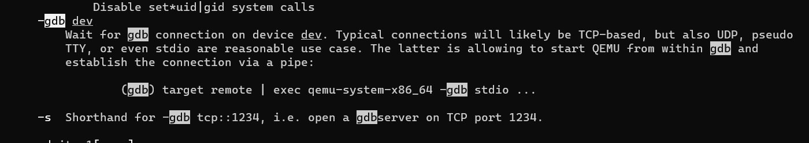

# QEMU+GDB

## QEMU

我们的实验要用到一个计算机硬件的模拟器，叫做`QEMU`。听到这个东西，是不是很熟悉？我们在`ICS`课上写过一个叫`NEMU`的东西，来模拟计算机的硬件，同时，我们记得`NEMU`里面还有一个叫做`Kernel`的东西。在操作系统课程的实验中，`QEMU`和`NEMU`类似，都是完全通过软件来模拟硬件的执行。但不同的是，`QEMU`这个系统十分庞大，功能非常强大。

实验过程中写出的操作系统，是可以在实际的硬件上运行的，但是如果直接在我们的电脑上运行，有以下两点坏处：

* 我们糟糕的代码直接运行在硬件上可能会损坏硬件
* 没办法进行调试

所以，我们采用`QEMU`模拟器来运行我们的操作系统，并通过`GDB`来进行`Debug`，具体操作在下面会解释。

## GDB

`GDB`我知道大家学过了，但是估计只学过一些比较简单的。下面教给大家一点黑科技。（暂时了解即可，在遇到需要GDB的地方时再回头看。）

利用`QEMU`模拟80386平台，运行自制的操作系统镜像`os.img`

```shell
 $ make
 $ qemu-system-i386 os.img
```

利用`QEMU`模拟80386平台，`Debug`自制的操作系统镜像`os.img`，选项 `-s` 在`TCP`的1234端口运行一个 `gdbserver`（不用懂，反正就是`QEMU`会把在其上运行的操作系统的执行信息发送给`GDB`），选项 `-S` 使得`QEMU`启动时不运行80386的`CPU`。

```
 $ qemu-system-i386 -s -S os.img
```

再另外开一个`shell`，启动`GDB`，连接上述`gdbserver`，在程序计数器`0x7c00`处添加断点，运行80386的 `CPU`，显示寄存器信息，单步执行下一条指令。

```shell
 $gdb #启动gdb 
 $(gdb)target remote localhost:1234 #gdb远程连接上gdbserber 
 ... 
 $(gdb)b *0x7c00 #打断点 
 $(gdb)r #运行 
 ... 
 $(gdb)info registers #查看寄存器的值 
 ... 
 $(gdb)si #逐句执行，执行下一步 
 ...
```

由于跟`GDB`有关的黑科技太多，为了让文档不太长，下面列出一些文档，你们可以参考：

* [(13条消息) GDB入门教程\_Dablelv的博客专栏-CSDN博客\_gdb菜鸟教程](https://blog.csdn.net/k346k346/article/details/50283861)：这里面有一些比较好用的`GDB`指令，比如查看源码，反汇编等等，请自行查阅相关指令。
* [GDB Documentation (sourceware.org)](https://sourceware.org/gdb/documentation/)：这是GDB官方用户手册，有能力的人可以参考。

## 补充

你可能会比较疑惑，我们是怎么知道`qemu-system-i386 -s -S os.img`要用这两个参数。其实这个可以通过`man`命令来搜索，输入`man qemu-system-i386`就可以进入到`qemu`的手册里，这里有任何关于`qemu`的知识。输入后，首先进入到qemu的手册界面：

然后输入斜杠`/`加上关键词来搜索，比如我想要用`gdb`调试`qemu`上的代码，就输入`/gdb`，敲回车。这时，会显示有`gdb`的内容。输入n查看下一个，输入N查看上一个！然后你就发现有一个什么`-s`参数会开启端口为1234的`gdb server`。它调用了`-gdb`参数，它让`qemu`等待`gdb`的链接。



这时你会发现，还没等你连上`gdb`，`qemu`就把代码跑完了。所以我们需要一个暂时不让`qemu`启动的选项。搜索关键词`start`，发现`-S`参数可以做到这点。


好了，齐活！参数找到了，开启qemu，再打开gdb远程连接即可！
