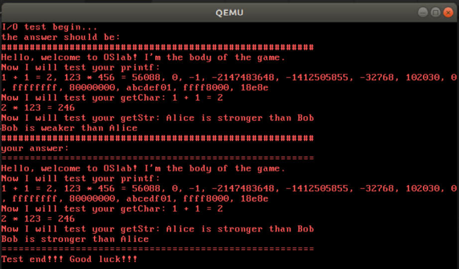

# 加载用户程序


task6：和加载Kernel差不多。

* [x] 填空：kvm.c里面的loadUMain。


请结合app的Makefile进行填空。（Makefile里面Ttext的参数竟然是0！！！）


exercise23：请结合gdt初始化函数，说明为什么链接时用"-Ttext 0x00000000"参数，而不是"-Ttext 0x00200000"。


## 测试程序

这时我们进行如下操作就可以测试我们的代码了：

```
$make clean
$make
$make play
```

如果代码正确的话，进行相应的输入（输入后记得敲回车才会显示结果！），会显示：



完结撒花！
