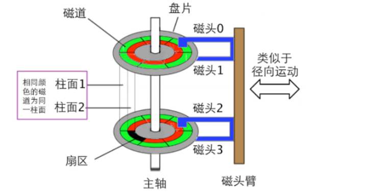

# 磁盘读写

## 回顾lab1

大家还记得lab1中加载os的模块嘛？在这一节中，我们来详细地讲解一下框架代码读取实验的过程，了解一下软件是如何操纵硬件进行IO操作的。

查看文件bootloader/boot.h，可以看到下面这些辅助函数。它们的作用是：利用in指令从特定硬件端口读取数据，利用out指令向特定的硬件端口写入数据。

```c
/* I/O functions */
static inline char inByte(short port) {
	char data;
	asm volatile("in %1,%0" : "=a" (data) : "d" (port));
	return data;
}

static inline int inLong(short port) {
	int data;
	asm volatile("in %1, %0" : "=a" (data) : "d" (port));
	return data;
}

static inline void outByte(short port, char data) {
	asm volatile("out %0,%1" : : "a" (data), "d" (port));
}
```

在boot.c文件中，我们可以看到下面这两个函数。我们可以大概看出来它们是做什么的，第一个函数的作用是等待磁盘空闲，可以进行下面的操作；第二个函数的作用是把第offset块（offset是从0开始的）磁盘的内容读到地址为dst的内存中。

```c
void waitDisk(void) { // waiting for disk
	...
}

void readSect(void *dst, int offset) { // reading a sector of disk
	...
}

```

## 什么原理？

### 磁盘结构

首先来了解一下磁盘的结构和读写过程。

磁盘的立体图如下图所示：



根据上图，我们介绍一下磁盘的构成：

* 盘片：每个盘片长得像原形的光碟，每个**盘片**正反面各有一个**盘面**，我们称为上盘面和下盘面。这样，我们可以为每一个盘面赋予一个编号，叫做盘面号（注意，下面会介绍一个别称），按照从上到下从0开始依次编号。
* 磁头：每个盘片都对应一个读写磁头，用来对这个盘片的内容进行读写。所以在硬盘系统中，**盘片号也叫作磁头号**。
* 磁道：盘片这个圆被划分为一圈圈同心圆，它们称为磁道，磁道从外向内从0开始编号。
* 扇区：刚刚说了，磁盘的一个磁道是一个圆，而这个圆被分成多个扇区。每个扇区分为512字节（这也是为什么bootloader要512字节的原因！！！）
* 柱面：所有盘面上的编号相同的磁道构成了一个圆柱，称为柱面。

磁盘的读取往往是按照一个扇区一个扇区来的（就如BIOS把MBR这个扇区中的bootloader读取出来）。那么如何确定我要读取哪个扇区呢？

回答：从上面看出来，磁盘是一个3维的结构，所以要确定位置就需要三个维度的信息。

* 根据柱面号确定在哪个同心圆（柱面），这是水平方向的一个维度。
* 根据磁头号找到是哪个盘面，即竖直方向的维度，这时搜索范围缩小在一个磁道、
* 通过扇区号，确定具体在磁道的哪个扇区，这也是水平的一个维度。

所以，只要我们知道**柱面号，盘面号，扇区号**这三个信息，就能够准确定位到一个扇区！！！

### 读写流程是啥样呢？

刚刚说了，知道三个信息就可以确定一个扇区的位置，那么读写的流程应该是这样的：

1. 磁头进行径向运动，来寻找柱面（就是磁头放到同心圆的圆周上）。这个过程是机械过程，需要耗费比较多的时间（因为磁头臂要径向移动）。
2. 盘片进行旋转，让磁头对准对应的扇区起始位置（盘片比磁头臂移动速度快很多）。
3. 对应的磁头进行读取（只有对应盘面号的磁头读取）。我们可以知道，确定哪个磁头进行读写根本不需要时间，因为是电信号！！！

从上面的信息我们可以知道，寻找三个维度的速度：找柱面<找扇区<找磁头。所以，在读写的时候能不动柱面就不动柱面。这样就导致了**连续的信息应先集中放在一个柱面上，如果这个柱面满了，再按顺序存放在相邻的柱面上**。而连续的信息，在某一个柱面上存放的方式是：先在同一盘面的磁道上存，然后下一盘面的磁道上按顺序存......


exercise1：既然说确定磁头更快（电信号），那么为什么不把连续的信息存在同一柱面号同一扇区号的连续的盘面上呢？（Hint：别忘了在读取的过程中盘面是转动的）


上面的内容可能比较绕，但是这是我们必备的知识（期末有可能考），如果绕不明白的话可以找几道相关的书后习题来做做！

## 如何表示某一个扇区？

我们有两种表示方法来确定一个扇区：CHS表示法和LBA表示法。

* CHS是由【Cylinder（柱面） Head（磁头） Sector（扇区）】的首字母组成的，根据上面所说，这三个维度就可以确定唯一的扇区。
* LBA是Logic Block Address的缩写。上面说过，磁盘是通过一定的顺序对扇区进行排列，所以我们可以对扇区进行编号（从0开始，我们叫做块地址）。那么只需要给出编号，就可以确定唯一的扇区。

那么，我们可以算出CHS表示法和LBA表示法的转换公式。


exercise2：假设CHS表示法中柱面号是C，磁头号是H，扇区号是S；那么请求一下对应LBA表示法的编号（块地址）是多少（注意：柱面号，磁头号都是从0开始的，扇区号是从1开始的）。


## 用软件操控磁盘

上面我们介绍了扇区的表示方法，那么自然而然想到：如果软件想要读取一个扇区，就要由下面几步：

1. 把扇区的LBA编号告诉硬件，或者把C、H、S告诉硬盘。
2. 再通知硬盘是读取还是写入。

为了防止不同厂家作出的硬盘读取方式不同，一个统一的标准诞生了，我们称为**IDE硬盘接口技术标准。**CPU和外设通过IO端口交互。说白了，这个标准就是规定了一些IO端口的作用。下面是用到的端口：

* 0x1F0：是传输数据的端口。
* 0x1F1：暂时不用管
* 0x1F2：要读取或写入的扇区数量
* 0x1F3：块地址的0\~7bit（LBA）
* 0x1F4：块地址的8\~15bit（LBA）
* 0x1F5：块地址的16\~23bit（LBA）
* 0x1F6：块地址的24-27bit（LBA）
* 0x1F7：状态寄存器，判断磁盘是否繁忙和通知磁盘是否可以进行读写操作。

再来看看readSect函数，是不是刚好对应得上？

```c
void readSect(void *dst, int offset) { // reading a sector of disk
	int i;
	waitDisk();
	outByte(0x1F2, 1);
	outByte(0x1F3, offset);
	outByte(0x1F4, offset >> 8);
	outByte(0x1F5, offset >> 16);
	outByte(0x1F6, (offset >> 24) | 0xE0);
	outByte(0x1F7, 0x20);

	waitDisk();
	for (i = 0; i < SECTSIZE / 4; i ++) {
		((int *)dst)[i] = inLong(0x1F0);
	}
}
```

那么，读取磁盘的过程就是：

1. 在0x1F2端口写入要读取的扇区数；
2. 在0x1F3到0x1F6按次序写入块地址；
3. 在0x1F7写入读指令号；
4. 通过waitDisk检查1F7H的忙位，检查是否繁忙；
5. 如果不繁忙，说明磁盘已经准备好，可以不断通过in指令从0x1F0读取数据。
