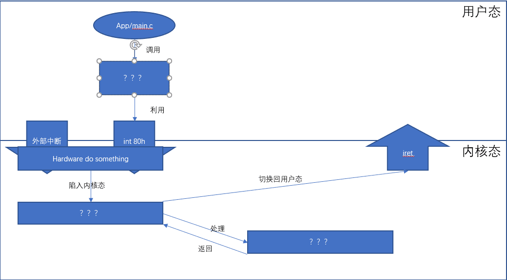

# 开始Coding

## 提醒

在介绍完基础知识过后（是不是有人没看基础知识就直接翻到这里了？），我们要开始写代码了。相信很多人在阅读基础知识的时候，看得云里雾里的。没错，刚开始就是这样，啥也记不住，但是一定要对前面的内容有些印象。这样在阅读代码的时候，可以迅速找到《基础知识》里的相应章节对照！！！**切忌前面的内容一点都不看，就来写代码，这样你会写的很痛苦！！！**

今年的代码部分，与往年相比减少了一些内容，难度也降低了很多。

在开始实验之前，先提供一个图来帮助大家理解实验框架，但是具体的实验代码需要大家主动深入探索：

上图是我们实验框架代码提供的中断处理思路，而你......完全可以推翻它，设计一个更完善的中断处理流程......
