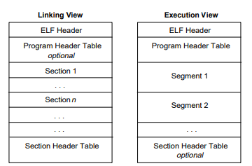
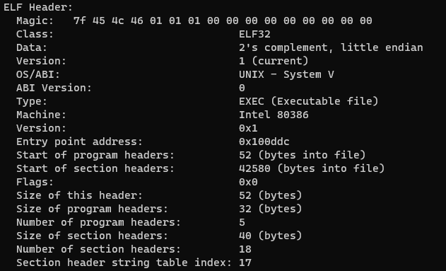
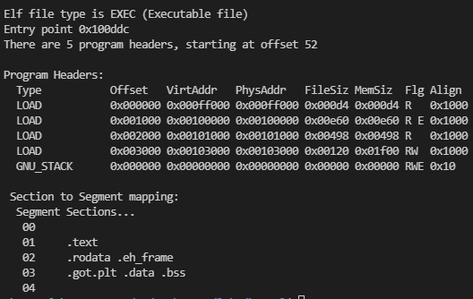

# 加载ELF

## 回顾lab1

在lab1中，我们说过，不管是ELF格式，还是EXE格式，这些格式的文件是为了提供关于程序尽可能多的信息，方便我们解析并加载到CPU上。所以，**我们的实验也可以把Kernel和用户程序编译成各种不同的文件格式（比如exe，elf，macho......），甚至你可以自己发明一种文件格式和相应的编译器**！

但是在这里，我们为了和ICS进行衔接，所以**采用ELF文件格式**，通过解析ELF文件，把Kernel和用户程序加载到内存中！

## 回顾ELF格式

ELF（Executable Linkable Format，可执行可链接格式）文件是一种文件格式，在Linux系统上的目标文件都遵守这个格式。

下面是ELF的基本结构图：



### 链接视图和执行视图

左边是链接视图（Linkable），右边是执行视图（Executable）。链接视图是以节（section）为单位，执行视图是以段（segment）为单位的。链接视图就是在链接时用到的视图，而执行视图则是在执行时用到的视图。

在链接过程中，链接器会把不同的.o文件中的相同类型的section处理成一个segment。比如你要将多个.o文件链接起来，每个文件都会有.text这个节，链接时就会把这些.text节里面的地址重定向，变成.text段（如果还是想不起来，请回头看看ICS学过的内容）。

在链接过后，ELF文件会变成执行视图。这时，该ELF文件就可以被加载运行。

### 执行视图的结构

因为我们的任务是加载Kernel和用户程序来运行，所以忽略链接视图，感兴趣的同学可以从下面的参考资料去了解。

ELF文件的执行视图主要由三个部分构成：

* ELF头（ELF header）
* 程序头表（Program Header Table）
* 各个段（segment）

#### ELF头

ELF头在文件的最开始部分，用于找到ELF文件的其他部分，并且提供有关ELF文件的相关信息。

使用如下命令可以读取ELF头：

```
$ readelf -h xxx 
```

让我们随便找一个ELF可执行文件看看ELF头。



这其中的各个条目，实际上可以构成一个结构体（请查看bootloader/boot.h文件）：

```c
struct ELFHeader {
	unsigned int   magic;     //魔数，上图Magic的前四个字节
	unsigned char  elf[12];   //包含上图Class，Data，Version......（可忽略）
	unsigned short type;      //目标文件类型，可执行还是可链接
	unsigned short machine;   //文件的目标体系结构类型，比如80386
	unsigned int   version;   //目标文件版本
	unsigned int   entry;     //程序入口（重要！）
	unsigned int   phoff;     //程序头表偏移量
	unsigned int   shoff;     //节头表偏移量（执行视图可忽略）
	unsigned int   flags;     //处理器相关表示
	unsigned short ehsize;    //ELF头的大小（数一数，刚好52字节）
	unsigned short phentsize; //程序头表中每个表项的大小（一般固定32字节，重要！）
	unsigned short phnum;     //程序头表的表项数目，上图中为5个，说明五个段（重要！）
	unsigned short shentsize; //节头表中每个表项的大小（执行视图可忽略）
	unsigned short shnum;     //节头表中表项数目（执行视图可忽略）
	unsigned short shstrndx;  //（忽略）
};
```

每个条目在固定的位置，所以可以通过结构体来进行解析。

其中比较重要的是跟程序头表有关的内容！！！

#### 程序头表

程序头表(**Program header table**) 列举了所有有效的段和他们的属性（执行视图）。

每一个段（比如.text，.data......）对应了一个程序头表项，表项里面包含了这些段的信息。如下图：



同样，我们可以在boot.h文件里找到程序头表表项对应的结构体：

```c
struct ProgramHeader {
	unsigned int type;
	unsigned int off;
	unsigned int vaddr;
	unsigned int paddr;
	unsigned int filesz;
	unsigned int memsz;
	unsigned int flags;
	unsigned int align;
};
```

其中，type为LOAD的段，需要被加载到内存里去。它相对于ELF起始位置的偏移量是off，应当被加载到PhysAddr的物理内存中去。文件的大小是filesz，在内存中占据的大小是memsz。

那么装载一个ELF可执行文件的过程就是：

1. 先通过readSect函数把ELF文件整体读入固定的位置。
2. 找到ELF可执行文件的ELF头。
3. 通过ELF可执行文件的头，找到程序头表的位置，并获知表项的多少（实际上程序头表就是个结构数组）。
4. 将type为LOAD的段装载到合适的位置上去。（注意，不要覆盖掉还未装载的段所占据的内存！！！）


exercise3：请自行查阅读取程序头表的指令，然后自行找一个ELF可执行文件，读出程序头表并进行适当解释（简单说明即可）。


在实验的后面，我将会提出一个非常奇怪的问题做challenge，来检测大家对ELF基础知识的掌握程度（可选，做不出来不扣分！）。🤣

## 参考资料

对ELF格式感兴趣（或想了解）的同学可以参考[ELF Specification](https://pdos.csail.mit.edu/6.828/2018/readings/elf.pdf)。
