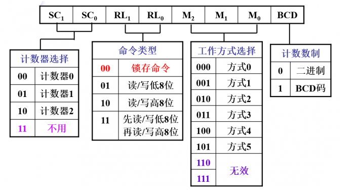

# 启动时钟源

在本次实验中，我们使用以下代码对8253可编程计时器进行设置，使得8253以频率 HZ 产生时间中断信号发送给 8259A可编程中断控制器；若依照代码框架 lab2/kernel/kernel/i8259.c 中给出的配置示例对8259A 进行设置，时间中断的中断向量为 0x20。

```c
#define TIMER_PORT 0x40
#define FREQ_8253 1193182
#define HZ 100
//#define HZ 1000

void initTimer() {
	int counter = FREQ_8253 / HZ;
	outByte(TIMER_PORT + 3, 0x34);
	outByte(TIMER_PORT + 0, counter % 256);
	outByte(TIMER_PORT + 0, counter / 256);
}

```

那么这个代码是啥意思呢？实际上我们在前面的lab里面已经了解过软件是如何配置硬件的了，无非就是在端口里面设置控制字（控制字可以理解为硬件的配置）。

8253内部有三分独立的计时器，其分别对应端口`0x40~0x42` （注意上面后面两个outByte是像0x40端口写入......），而控制字对应于`0x43`端口。**这三个计时器相互之间不依赖，独立工作，每个都有自己一套寄存器资源。同时，8253还有6种工作方式。**

选择哪种工作模式，如何去工作......这些问题都通过配置控制字来进行。那么控制字又是什么呢？我们知道，每个端口对应于一个字节，也就是8bit，如下图。我们控制这一个字节中的每一比特即可成功设置8253。

根据上面的代码我们像控制字写入0x34，即00110100b，说明：

* 计数器选择：选择计数器0
* 读写类型：先读写第八位，再读写高八位
* 工作方式：方式2
* 计数数制：二进制



这里中断的初始值被设置为11932，这是我们想要中断信号的频率为100Hz（每秒发生100次中断）。 即1.19318Mhz（计数器的频率）/100 = 11932。计数器往往是倒计时，也就是说，计数器每跳动11932次就会触发一次时钟中断。
