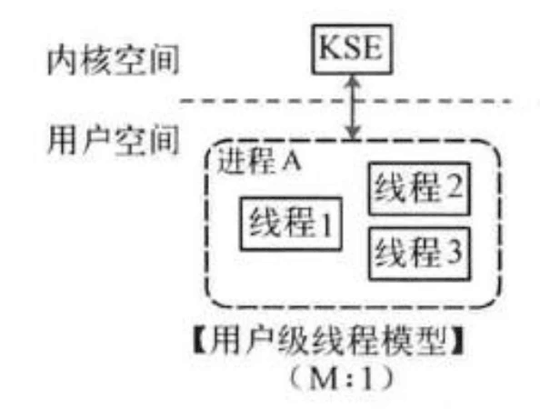
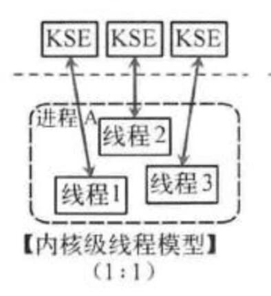

# 线程

本章节的习题分数占比很小，但是对于比较深入理解线程很有帮助，请至少尝试做一下本章习题。我们提供的信息可能不多，需要大家动手上网合理搜索。

## 什么是线程？

进程和线程是分不开的，下面我们介绍一下线程是什么。**线程**（英语：thread）是[操作系统](https://zh.wikipedia.org/wiki/%E6%93%8D%E4%BD%9C%E7%B3%BB%E7%BB%9F)能够进行运算[调度](https://zh.wikipedia.org/wiki/%E8%B0%83%E5%BA%A6)的最小单位。大部分情况下，它被包含在[进程](https://zh.wikipedia.org/wiki/%E8%BF%9B%E7%A8%8B)之中，是[进程](https://zh.wikipedia.org/wiki/%E8%BF%9B%E7%A8%8B)中的实际运作单位。一条线程指的是[进程](https://zh.wikipedia.org/wiki/%E8%BF%9B%E7%A8%8B)中一个单一顺序的控制流，一个进程中可以并发多个线程，每条线程并行执行不同的任务。

## 线程占据哪些资源？

运行的程序可以看做是状态机，这些状态由全局变量，堆区，栈区，pc，寄存器......组合而成。

不同的进程之间是被完全隔离的，它们拥有独立的全局变量，堆区，栈区，pc，寄存器。所以我们在实验中，你会发现，每次创建一个新的进程，就要给它分配一块独立的空间。

而线程是同一进程内更小的计算单位。它们之间**共享同一进程的全局变量和堆区**，但是**不共享栈区，pc和寄存器**。创建一个线程，只需要为它分配一块栈区即可，不需要像fork一样进行地址空间拷贝。所以说，线程是轻量级进程。

那么，为什么线程只占据这些资源呢？（或者说，既然线程是最小计算单位，那只要寄存器不就好了？）

实际上，我们的线程往往是执行一个函数（请看看pthread\_create这些线程库函数），而我们在ics里学过，函数的调用和返回实际上就是栈帧的创建和释放，所以，函数所需的最小资源就是线程所需的最小资源。


exercise7：那么，线程为什么要以函数为粒度来执行？（想一想，更大的粒度是......，更小的粒度是......）


## 动手操作

光看教程，你很难对线程是什么有一个很好的理解，所以，请自行搜索以下几个函数的用法，和一些经典程序，亲身体会一下线程究竟是什么。

* pthread\_create
* pthread\_join
* ......

## 线程和进程的对比

我们来引用Wikipedia的内容：

> #### Threads vis-à-vis processes
>
> Threads differ from traditional [multitasking](https://en.wikipedia.org/wiki/Computer\_multitasking) operating-system [processes](https://en.wikipedia.org/wiki/Process\_\(computing\)) in several ways:
>
> * processes are typically independent, while threads exist as subsets of a process
> * processes carry considerably more [state](https://en.wikipedia.org/wiki/State\_\(computer\_science\)) information than threads, whereas multiple threads within a process share process state as well as [memory](https://en.wikipedia.org/wiki/Computer\_storage) and other [resources](https://en.wikipedia.org/wiki/Resource\_\(computer\_science\))
> * processes have separate [address spaces](https://en.wikipedia.org/wiki/Address\_space), whereas threads share their address space
> * processes interact only through system-provided [inter-process communication](https://en.wikipedia.org/wiki/Inter-process\_communication) mechanisms
> * [context switching](https://en.wikipedia.org/wiki/Context\_switch) between threads in the same process typically occurs faster than context switching between processes
>
> Advantages and disadvantages of threads vs processes include:
>
> * _Lower resource consumption_ of threads: using threads, an application can operate using fewer resources than it would need when using multiple processes.
> * _Simplified sharing and communication_ of threads: unlike processes, which require a [message passing](https://en.wikipedia.org/wiki/Message\_passing) or shared memory mechanism to perform [inter-process communication](https://en.wikipedia.org/wiki/Inter-process\_communication) (IPC), threads can communicate through data, code and files they already share.
> * _Thread crashes a process_: due to threads sharing the same address space, an illegal operation performed by a thread can crash the entire process; therefore, one misbehaving thread can disrupt the processing of all the other threads in the application.

## 一些挑战

线程的实现方式多种多样，分别是内核级线程，用户级线程，两级线程。

用户级线程就是在用户态下进行堆栈分配（我们提供了一个用户级线程库），然后进行切换，而不需要使用系统调用。



内核级线程是通过系统调用来实现，具体过程跟fork这些差不多。



两级线程模型有点复杂，感兴趣可以自行了解。


challenge2：请说说内核级线程库中的 pthread\_create 是如何实现即可。



challenge3：你是否能够在框架代码中实现一个简易内核级线程库，只需要实现create，destroy函数即可，并仍然通过时钟中断进行调度，并编写简易程序测试。**不写不扣分，写出来本次实验直接满分**。


我们今年提供了一个用户级线程库的实现（水兵gg写的），请看thread文件夹，程序不需要qemu就可以运行，在Linux命令行中下面命令即可编译运行：

```
gcc -m32 --no-warnings -g main.c thread.c && ./a.out
```

线程库里面包含了四个函数，并且运用了一些宏和内联汇编，大家只需要理解代码即可。

* 创建线程：int create\_thread(\_\_uint32\_t func, int argNum, ...);
  * 创建一个线程来运行函数func，argNum是func的参数个数，变长参数列表是func的参数列表
  * 它的作用是：找到一块合适的tcb（注意，tcb里面包含了线程的stack），在栈区里面放置好函数的参数，然后等待调度运行。
* 继续运行线程：int launch\_thread(int id);
  * id是需要运行的线程编号
  * 它会调用launch宏，把当前的esp和pc保存起来，恢复id线程的esp和pc
* 暂停线程：void yield\_thread(int ret);
  * 线程主动交出控制权，把ret作为返回值（注意，观察是怎么返回的）
* 销毁线程：void destory\_thread();
* 获取线程状态：enum threadStatus getThreadStatus(int id);

下面有一个challenge（如果觉得有难度可以在写完实验代码后再来理解）


challenge4：（不写不扣分，写了加分）

1. 在create\_thread函数里面，我们要用线性时间搜索空闲tcb，你是否有更好的办法让它更快进行线程创建？
2. 我们的这个线程库，父子线程之间关联度太大，有没有可能进行修改，并实现一个调度器，进行线程间自由切换？（这时tcb的结构可能需要更改，一些函数功能也可以变化，你可以说说思路，也可以编码实现）
3. 修改这个线程库或者自由设计一个线程库。

