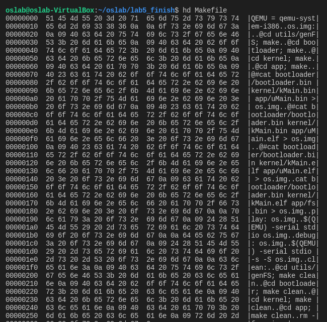

# 什么是文件

### **字节序列**

**"文件是由文件名标识的一组信息的集合"**，这是一些操作系统教材中对文件的定义。

更具体的，我们可以认为文件是对字节序列的一种抽象。我们已经见识过这种抽象了：在前面的实验中我们要将bootloader、kMain和uMain三个elf文件拼接成一个img的文件，实际上就是一个字节序列。将os.img抽象成字节序列，因而可以通过数组的方式实现；我们可以为磁盘上每个字节编号，例如第x柱面第y磁头第z扇区中的第n字节,把磁盘上所有的字节按照编号的大小进行排序,便得到了 一个字节序列...而文件则是字节序列中的一部分,当然也是字节序列。

有很多例子可以让我们相信这种字节序列的抽象是符合直觉的. 使用hd命令查看我们的Makefile文件：



这些字节序列可以存储在磁盘和内存中，所以，我们对文件的操作，实际上就是对字节序列在磁盘和内存中的一些操作。

虽然不同的文件都可以被抽象成字节序列，但直觉上一个文本文件和一个图片文件显然含有不同的内容：我们可以使用图像工具来浏览图片文件，却不能浏览文本文件。这种不同其实取决于如何对字节序列进行解释。

### Everything is a file

如果我们将字节序列的含义赋予文件，那么我们刚才讨论的文件只是一种普通文件。事实上，计算机系统中到处都是字节序列，我们可以轻松地举出很多例子：

* 配置文件作为一种普通文件，当然也是一种字节序列，对它的解释由使用这个配置文件的程序决定，例如内核的IP转发功能。
* 管道是一种先进先出的字节序列, 本质上它是内存中的一个队列缓冲区&#x20;
* socket（网络套接字）也是一种字节序列，它有一个缓冲区，负责存放接收到的网络数据包，上层应用将 socket中的内容看做是字节序列，并使用receive操作接收这些内容。
* 虚拟设备也可以看做是字节序列，例如/dev/random，/dev/zero等，这些字节序列比较特殊，它们有各自的特点，例如random的字节序列是不确定的，zero的字节序列则总是0。
* 甚至硬件也可以看成是字节序列，我们之前已经见识到，磁盘和内存可以抽象成字节序列，其实各种硬件设备都可以, 例如我们在键盘上按顺序敲入按键的编码形成了一个字节序列，显示器上每一个像素的内容按照其顺序也可以看做是字节序列...&#x20;

Unix将这些五花八门的字节序列全部都看做文件，因此有"Everything is a file"的说法。根据"Everything is a file"的**抽象，** iNode结构中有用于表示与该文件相关联的设备的属性dev\_id，对于存储在磁盘/RAMDISK中的文件，其 iNode结构中的dev\_id属性都是hda/ram设备的号码。这种做法最直观的好处就是为不同的事物提供了统一的接口：我们可以使用文件的接口来操作计算机上的一切，而不必对它们进行详细的区分，例如：

可以通过往配置文件中写入1, 来打开内核的IP转发功能。

```shell
echo 1 > /proc/sys/net/ipv4/ip_forward
```

可以以十六进制的方式查看磁盘上MBR的内容。

```shell
head -c 512 /dev/sda | hd
```

下面这段include则会将urandom中的内容包含到头文件中, 由于urandom是一个长度无穷的字节序列, 提交一个包含上述内容的 程序源文件将会令一些检测功能不强的Online Judge平台直接崩溃。

```c
#include "/dev/urandom"
```

"Everything is a file"的抽象使得我们可以通过标准工具很容易完成一些在Windows下不易完成的工作，这其实体现了Unix哲学的部分内容：每个程序采用文本文件作为输入输出，这样可以使程序之间易于合作。Linux继承自 Unix，也自然继承了这种优秀的特性。

