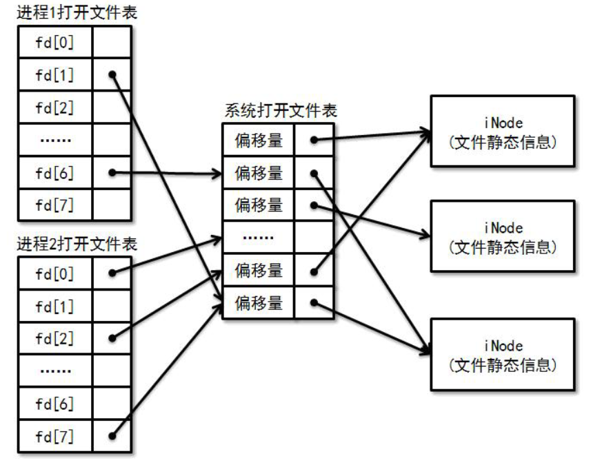

# 文件操作

### 基本操作

相信大家已经接触过很多文件操作了（比如在程设实验上）。比较常用的是文件读写操作：

```c
int read(int fd, void *buffer, int size);
int write(int fd, void *buffer, int size);
```

其中 fd 为文件描述符，是文件的一个标识。文件作为一种资源（不同的进程需要对不同的文件进行读写），操作系统需要对其进行管理。很自然地，**每一个进程都需要拥有一张文件描述符表**，记录了一个进程打开了哪些文件，每一 个有效的文件描述符都对应一个文件的信息。


exercise1：想想为什么我们不使用文件名而使用文件描述符作为文件标识。

int read(const char \*filename, void \*buffer, int size);&#x20;

int write(const char \*filename, void \*buffer, int size);


还有常用的文件操作比如，

```c
int open(char *path, int flags)
int close(int fd);
int dup(int oldfd);
int dup2(int oldfd, int newfd);
```

上面哪些请你自行搜索了解......（其实强烈推荐阅读Xv6的部分源码，很易懂，随实验代码附送）

如果我们不希望每次读写操作都需要从头开始，于是我们需要为每一个已经打开的文件引入偏移量属性，来记录目前文件操作的位置。每次对文件读写了多少个字节，偏移量就前进多少。偏移量也可以通过lseek系统调用来调整，它的函数原型为：

```c
int lseek(int fd, int offset, int whence);
```

### 打开文件表

我们希望允许多个进程打开同一个文件（例如使用不同的终端同时浏览同一份文档），但同时希望关系密切的进程（例如父子进程）之间能够共享文件的偏移量。考虑以下父子进程同时写入一个日志文件：

```c
int fd = open("log.txt");
if(fork() != 0) {
write(fd, buf1, len1);
}
else {
write(fd, buf2, len2);
}
```

若父子进程没有共享文件的偏移量，那么必定有一方写的结果被另一方覆盖。因此，文件的偏移量不应该放在进程的文件描述符表中，否则将不能支持偏移量的共享。另一方面，我们也不希望不相关的进程之间共享同一个偏移量，因此偏移量也不应该作为文件的一个静态属性，否则打开同一个文件的所有进程都将共享同一个偏移量。

我们通过引入一张"系统打开文件表"来解决这个问题：打开文件的偏移量放在系统打开文件表中，通过让不同的文件描述符指向系统打开文件表的同一个表项来实现偏移量的共享。



为了实现上述要求，我们需要对进程的文件描述符表和系统打开文件表进行适当的维护：

* 每当执行open时，需要在系统打开文件表中添加一项，来增加一个独立的偏移量。
* 每当执行close时，需要对系统打开文件表中相应表项的引用计数器减1。（当引用计数器减为0时，代表没有文件描述符引用该表项，因此需要对其进行回收。
* 每当执行fork时，只需要对父进程的文件描述符表进行浅拷贝（我们可以放在pcb里），并**对系统打开文件表中相应表项的引用计数器加 1**，来实现父子进程偏移量的共享。
* 每当执行exec时, 不需要对两者进行任何修改。
* 每当执行exit时, 相当于对文件描述符表中所有有效的表项分别执行了close。


exercise2：为什么内核在处理exec的时候，不需要对进程描述符表和系统文件打开表进行任何修改。（可以先往下看看再回答，或者**阅读一下Xv6的shell**）


### 标准输入输出

为了方便进程进行标准输入输出，操作系统准备了三个默认的文件描述符：

```c
#define STDIN_FILENO 0
#define STDOUT_FILENO 1
#define STDERR_FILENO 2
```

我们经常使用的printf，最终会调用 write(STDOUT\_FILENO, buf, len) 进行输出；而scanf将会通过调用 read(STDIN\_FILENO, buf, len)进行读入。

当内核载入第一个用户进程的时候，需要手动在文件描述符表和系统打开文件表中填写这三个默认文件描述符的表项。从此以后，文件描述符表和系统打开文件表将通过系统调用来维护，内核不必额外处理。

理解了 "Everything is a file" 的特性之后，我们可以很容易地理解标准输入/输出的工作过程。在上面的例子中，printf将会输出到一个叫 stdout 的文件中。你可以在/dev目录下找到它，它是一个软链接（这个概念还记得吗？），追根溯源后你会发现，它指向了一个设备文件，这个设备文件代表的正是终端。这样，输出到代表终端的设备文件实际上是调用了终端驱动程序的dev\_write, 于是屏幕上就出现了输出的内容。

### 重定向

我们在shell里面可以这样实现重定向，首先fork出子进程，然后在子进程里面把stdout关掉，再开启重定向的目标文件，之后再执行要执行的指令，比如ls。这时ls在执行的时候，以为认为输出到了stdout，但实际上stdout已经被a.txt替代了。是不是很妙......

```c
if((pid = fork()) == 0) {
// child
close(STDOUT_FILENO);
open("a.txt");
exec("ls");
}
else {
// father
waitpid(pid);
}
```

### 管道

管道能够将一个进程的输出作为另一个进程的输入，在这里我们只讨论匿名管道。创建一个管道的系统调用为：

```c
int pipe(int pipefd[2]);
```

如果成功执行，在 pipfd 里面存入两个描述符，其中 pipfd\[0] 是读端，pipfd\[1] 是写端。

往管道里写入数据之后，数据不一定立刻被读出。所以管道实际上是一个先进先出缓存队列。

```
typedef struct pipe {
int front, rear;
pid_t read_wait_queue[LEN], write_wait_queue[LEN];
uint8_t buf[BUF_LEN];
} Pipe;
```

需要注意的是，当管道读写失败的时候（比如写的时候缓存满了或者没有数据要读），需要把请求读写的进程放到相应的等待队列中，当其他进程进行读写操作之后，再唤醒阻塞的进程，这和生产者消费者问题类似......

我们仍然将管道抽象成文件，但我们并不需要像普通文件那样读写磁盘，因为管道的缓冲区实际上是在内存中, 应该由文件系统进行管理。因此我们需要为系统打开文件表的 dev\_id 属性增加一种PIPE类型，可以将其值设置为-1(设备号总是非负的)，用于指示一个管道文件。另外，由于管道中的数据总是先进先出的，不能随机访问，因此偏移量对管道来说是没有意义的，故管道两端的文件描述符均可指向系统打开文件表中的同一项，并且当其引用计数器减为0时, 需要回收相应的管道。



challenge1：system函数（自行搜索）通过创建一个子进程来执行命令。但一般情况下, system的结果都是输出到屏幕上，有时候我们需要在程序中对这些输出结果进行处理。一种解决方法是定义一个字符数组，并让 system 输出到字符数组中。如何使用重定向和管道来实现这样的效果？

Hint：可以用pipe函数（自行搜索）、read函数（你们都会）......

（在Linux系统下自由实现，不要受约束）


### 绝对路径和相对路径

你应该听说过文件的绝对路径和相对路径。

绝对路径是指从根目录到文件所在位置的完整路径，但如果每次指定 一个文件都需要使用绝对路径，操作起来就会显得十分繁琐，尤其是目录层数很深的时候。为了方便用户使用，文件系统引入了相对路径的概念，允许通过当前工作目录来定位文件。

那么当前工作目录在哪里呢? 聪明的你应该想到，当前**工作目录不应该是全局的**，否则不同进程都通过相对路径来访问文件的时候将会产生干扰。因此, **每个进程都应该拥有它的工作目录**, 并且

* 通过fork创建子进程时，子进程将会继承父进程的工作目录。
* 通过exec执行新程序时，工作目录将会改为新程序所在的目录。
* 文件系统需要向用户进程提供一个切换目录的系统调用。


exercise3：我们可以通过which指令来找到一个程序在哪里，比如 which ls，就输出ls程序的绝对路径（看下面，绝对路径是/usr/bin/ls）。那我在/home/yxz这个目录执行ls的时候，为什么输出/home/yxz/路径下的文件列表，而不是/usr/bin/路径下的文件列表呢？（请根据上面的介绍解释。）


```shell
yxz@changanyyy:~/xv6-riscv$ which ls
/usr/bin/ls
```

### Ext4

我们的实验是类Unix的，所以采用跟ext4类似的文件系统结构，但是绝大部分API已经是封装好的，所以我并没有在手册里介绍Ext文件系统。但为了完成实验，还是**需要对inode等概念有一定的了解**。[这里](https://www.junmajinlong.com/linux/ext\_filesystem/)有一份还不错的教程，可以参考。[这里](https://ext4.wiki.kernel.org/index.php/Ext4\_Disk\_Layout)则是官方教程，可以阅读一下提升能力。
