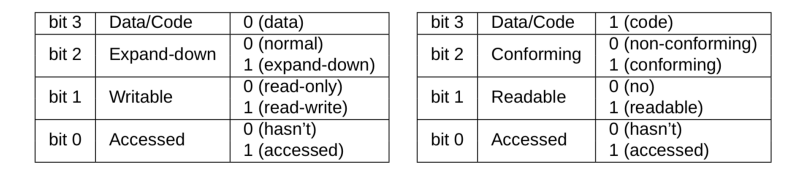

# 😭 保护模式

### 变化

80386开始，Intel处理器步入32位CPU；80386有32位地址线，其寻址空间为 2^32=4GB ；为保证兼容 性，实模式得以保留，PC启动时CPU工作在实模式（BIOS运行过程中可能会开启保护模式），并由Bootloader迅速完成从实模式向保护模式的切换。

下面是保护模式的一些不同。

1. 保护模式下的寄存器
   * 通用寄存器(从 16 位扩展为 32 位): EAX，EBX，ECX， EDX，ESI，EDI，EBP，ESP
   * 段寄存器(维持 16 位): CS，DS，SS，ES，FS，GS
   * 状态和控制寄存器(32/64 位): EFLAGS，EIP，CR0，CR1， CR2，CR3
   * 系统地址寄存器: GDTR，IDTR，TR，LDTR
   * 调试与测试用寄存器: DR0，· · · ，DR7，TR0，· · · ，TR7
2. 寻址方式的变化
   * 在保护模式下，分段机制是利用一个称作段选择子（`Selector`）的偏移量到全局描述符表中找到需要的段描述符，而这个段描述符中就存放着真正的段的物理首地址，该物理首地址加上偏移量即可得到最后的物理地址。
   * 一般保护模式的寻址可用 0xMMMM:0xNNNNNNNN 表示，其中 0xMMMM 表示段选择子的取值，16 位(其中高 13 位表示其对应的段描述符在全局描述符表中的索引，低 3 位表示权限 等信息)，0xNNNNNNNN 表示偏移量的取值，32 位。
   * 段选择子为 CS，DS，SS，ES，FS，GS 这些段寄存器。

### 寻址过程

在保护模式下，寻址方式会产生变化。简单来说，程序给出的32位地址不再直接解释为物理地址，而是相对于某一个段的偏移量（`offset`）。真正的物理地址由下式给出：

```
 physical address = base address + offset
```

其中的`base address`是一个32位的地址，对应某个段的基地址；而`offset`则是程序给出的32位段内偏移量。基地址存储在**段描述符**里面，而**段描述符需要通过Selector来寻找**！

当开启保护模式后，QEMU中运行的程序访在问内存时给出的就不简单是32位的物理地址了，而是由一个16位的段选择符加上32位的段内偏移量（有效地址）所构成的48位的逻辑地址！

```
           15              0    31                                   0
  LOGICAL +----------------+   +-------------------------------------+
  ADDRESS |    SELECTOR    |   |        OFFSET (EFFECTIVE ADDR)      |
          +---+---------+--+   +-------------------+-----------------+

48位逻辑地址结构
```

### GDT

全局描述符表（`Global Descriptor Table`），即`GDT`，`GDT`由一个个被称为**段描述符**的表项组成，表项中定义了段的起始32位物理地址，段的界限，属性等内容；段描述符的结构如下图所示

```
DESCRIPTORS USED FOR APPLICATIONS CODE AND DATA SEGMENTS

  31                23                15                7               0
 +-----------------+-+-+-+-+---------+-+-----+-+-----+-+-----------------+
 |                 | | | |A|         | |     | |     | |                 |
 |   BASE 31..24   |G|X|O|V| LIMIT   |P| DPL |1| TYPE|A|  BASE 23..16    | 4
 |                 | | | |L| 19..16  | |     | |     | |                 |
 |-----------------+-+-+-+-+---------+-+-----+-+-----+-+-----------------|
 |                                   |                                   |
 |        SEGMENT BASE 15..0         |       SEGMENT LIMIT 15..0         | 0
 |                                   |                                   |
 +-----------------------------------+-----------------------------------+

           A      - ACCESSED
           AVL    - AVAILABLE FOR USE BY SYSTEMS PROGRAMMERS
           DPL    - DESCRIPTOR PRIVILEGE LEVEL
           G      - GRANULARITY
           P      - SEGMENT PRESENT
```

你可以把段描述符当做一个结构体，这样，段表就相当于一个**结构数组。**

这里是段描述符每个部分的含义：

* 每个段描述符为 8 个字节，共 64 位
* 段基址为第 2，3，4，7 字节，共 32 位
* 段限⻓为第 0，1 字节及第 6 字节的低 4 位，共 20 位，表示该段的最大⻓度
* G代表粒度，说明段限长的单位是什么（4KB或者1B）。当属性 G 为 0 时，20 位段限⻓为实际段的最大⻓度(最大为 1MB)；当属性 G 为 1 时，该 20 位段限⻓左移 12 位后加上 0xFFF 即为实际段的最大⻓度(最大为 4GB) 。
* D/B: 对于不同类型段含义不同
  * 在可执行代码段，该位叫做 D 位，D 为 1 时，使用 32 位地址和 32/8 位操作数，D 为 0 使用 16 位地址和 16/8 位操作数
  * 在向下扩展的数据段中，该位叫做 B 位，B 为 1 段的上界为 4GB，B 为 0 段的上界为 64KB
  * 在描述堆栈段的描述符中，该位叫做 B 位，B 为 1 使用 32 位 操作数，堆栈指针用 ESP，B 为 0 使用 16 位操作数，堆栈指针用 SP
* AVL：Available and Reserved Bit，通常设为 0
* P：存在位，P 为 1 表示段在内存中
* DPL：描述符特权级，取值 0-3 共 4 级;0 特权级最高，3 特权级最低，表示访问该段时 CPU 所处于的最低特权级，后续实验会详细讨论
* S：描述符类型标志，S 为 1 表示代码段或数据段，S 为 0 表示系统段(TSS，LDT)和门描述符
* TYPE：当 S 为 1，TYPE 表示的代码段，数据段的各种属性如下表所示



### 段选择子如何查找段描述符

为进入保护模式，需要在内存中开辟一块空间存放GDT表；80386提供了一个**寄存器 `GDTR` 用来存放`GDT` 的32位物理基地址以及表长界限**；在将GDT设定在内存的某个位置后，可以**通过 LDGT 指令将GDT的入 口地址装入此寄存器。**

```
          GDT REGISTER
                  15            0
                 +---------------+
                 |   GDT LIMIT   |
+----------------+---------------|
|            GDT BASE  	         |
+--------------------------------+
 31                             0
```

由 GDTR 访问GDT是由**段选择子（理解成段选择子里包含数组下标）**来完成的；为访问一个段，需将段选择子存储入**段寄存器**，比如数据段选择子存储入 `DS` ，代码段选择子存储入 `CS` ；其数据结构如下

```
 15                      3   1 0
+-------------------------+-+---+
|                         |T|   |
|          INDEX          | |RPL|
|                         |I|   |
+-------------------------+-+---+
TI - TABLE INDICATOR, 0 = GDT, 1 = LDT
RPL - REQUESTOR'S PRIVILEGE LEVEL
```

`TI`位表示该段选择子为全局段还是局部段，`RPL`表示该段选择子的特权等级，13位`Index`表示描述符表中的编号（下标）


下图是逻辑地址到物理地址的转换：

```
         15              0    31                                  0
LOGICAL +----------------+   +-------------------------------------+
ADDRESS |    SELECTOR    |   |               OFFSET                |
        +---+---------+--+   +-------------------+-----------------+
     +------+         !                          |
     | DESCRIPTOR TABLE                          |
     |  +------------+                           |
     |  |            |                           |
     |  |            |                           |
     |  |            |                           |
     |  |            |                           |
     |  |------------|                           |
     |  |   SEGMENT  | BASE          +---+       |
     +->| DESCRIPTOR |-------------->| + |<------+
        |------------| ADDRESS       +-+-+
        |            |                 |
        +------------+                 |
                                       !
             LINEAR +------------+-----------+--------------+
            ADDRESS |     DIR    |    PAGE   |     OFFSET   |
                    +------------+-----------+--------------+
```

### 总结地址转换过程

结合虚拟地址、段选择符和段表的相关概念，在分段机制中，将虚拟地址转换成线性地址（此时即为物理地址）的过程可描述如下：

1. 根据段选择子中的`TI`位选择GDT或LDT；
2. 根据段选择子中的`index`部分到GDT中找到对应位置上的段描述符；
3. 读取段描述符中的`base`部分，作为32位段基址，加上32位段内偏移量获取最终的物理地址。


### Reference

本节部分内容摘自《计算机系统基础》PA-3-2的手册。
