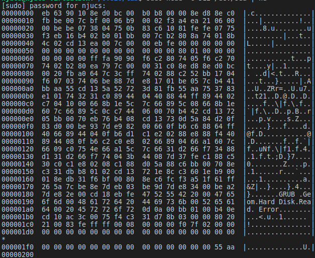

# MBR & Bootloader

在开机的第一条指令这个模块，我们提到了MBR。MBR的全程叫做Master Boot Record，是磁盘里的某个扇区，但绝大多数放在0号柱面，0号磁头，0号扇区对应的扇区。大小占扇区，共512字节。末尾有一个标识的东西，叫“魔数”（magic number），作用是告诉BIOS：“这里是MBR，你找对了。把我加载上去就可以启动操作系统”了。

MBR是一个扇区，而里面的代码，我们常常叫做Bootloader，大概翻译过来就叫**启动加载器。**从名字就可以看出，它可以把真正的OS（Operating System，后面OS即指“操作系统”）加载到内存中，然后把控制权交给OS！

### 先看看MBR长什么样子

在Linux中, 我们可以很容易地查看磁盘的MBR（记得`sudo`）：

```
head -c 512 /dev/sda | hd
```




你可以在输出结果的末尾看到魔数 0x55 和 0xaa 。

有了这个魔数, `BIOS`就可以很容易找到可启动设备了: `BIOS`依次将设备的首扇区加载到内存 0x7c00 的位置，然后检查末尾两个字节是否为 `0x55` 和 `0xaa`.

`0x7c00` 这个内存位置是`BIOS`约定的, 如果你希望知道为什么采用 `0x7c00` , 而不是其他位置, [这里](https://www.glamenv-septzen.net/en/view/6)可以给你提供一些线索.

如果成功找到了魔数，BIOS将会跳到 `0x7c00` 的内存位置， 执行刚刚加载的启动代码， 这时BIOS已经完成了它的使命， 剩下的启动任务就交给 MBR了; 如果没有检查到魔数, BIOS将会尝试下一个设备; 如果所有的设备都不是可启动的, BIOS将会发 出它的抱怨："找不到启动设备".

BIOS加载主引导扇区后会跳转到 `CS:IP=0x0000:0x7c00` 执行加载程序，这就是我们操作系统实验开始 的地方。在我们目前的实验过程中，主引导扇区（MBR）和加载程序（bootloader）其实代表一个东西。但是现代操作系统中，他们往往不一样，请思考一下为什么？主引导扇区中的加载程序的功能主要是将操作系统的代码和数据从磁盘加载到内存中 跳转到操作系统的起始地址。其实真正的计算机的启动过程要复杂很多，有兴趣请自行了解。

### 补充

MBR和Bootloader的区别是什么？MBR是一块磁盘扇区，而Bootloader是这块扇区里面的一小段代码。

这块扇区里面不一定非得是Bootloader，可以是你写的任何程序。我们会在后面给予你直观的印象。
