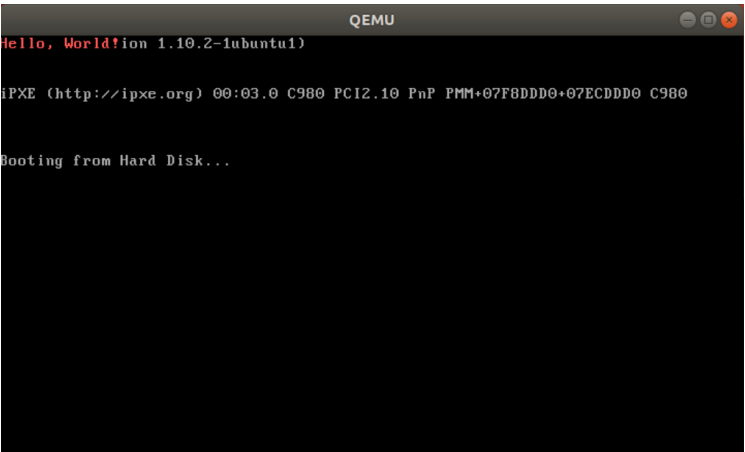

# 🥲 操作一波

### 一系列操作

在配置好实验环境之后，先建立一个操作系统实验文件夹存放本实验代码：

```shell
$mkdir OS2022
```

进入创建好的文件夹，创建一个mbr.s文件：

```shell
$cd OS2022
$touch mbr.s
```

然后将以下内容保存到 mbr.s 中：

```shell
.code16
.global start
start:
movw %cs, %ax
movw %ax, %ds
movw %ax, %es
movw %ax, %ss
movw $0x7d00, %ax
movw %ax, %sp         # setting stack pointer to 0x7d00
pushw $13             # pushing the size to print into stack
pushw $message        # pushing the address of message into stack
callw displayStr      # calling the display function
loop:
jmp loop
message:
.string "Hello, World!\n\0"
displayStr:
pushw %bp
movw 4(%esp), %ax
movw %ax, %bp
movw 6(%esp), %cx
movw $0x1301, %ax
movw $0x000c, %bx
movw $0x0000, %dx
int $0x10
popw %bp
ret
```

接下来使用gcc编译得到mbr.s文件：

```shell
$gcc -c -m32 mbr.s -o mbr.o
```

文件夹下会多一个mbr.o的文件，接下来使用ld进行链接：

```shell
$ld -m elf_i386 -e start -Ttext 0x7c00 mbr.o -o mbr.elf
```

我们会得到mbr.elf文件，查看一下属性。

```shell
$ls -al
...
-rwxr-xr-x 1 abc abc 3588 2月 15 19:50 mbr.elf
-rw-r--r-- 1 abc abc 656 2月 15 19:46 mbr.o
-rw-r--r-- 1 abc abc 594 2月 15 19:43 mbr.s
```

我们发现`mbr.elf`的大小有`3588byte`，这个大小超过了一个扇区，不符合我们的要求。


exercise6：假设mbr.elf的文件大小是300byte，那我是否可以直接执行qemu-system-i386 mbr.elf这条命令？为什么？


> 不管是i386还是i386之前的芯片，在加电后的第一条指令都是跳转到BIOS固件进行开机自检，然 后将磁盘的主引导扇区（Master Boot Record, MBR ；0号柱面，0号磁头，0号扇区对应的扇区， 512字节，末尾两字节为魔数 0x55 和 0xaa ）加载到0x7c00。

所以我们使用objcopy命令尽量减少mbr程序的大小：

```shell
$ objcopy -S -j .text -O binary mbr.elf mbr.bin
```

再查看，发现mbr.bin的大小小于一个扇区。

```shell
$ ls -al mbr.bin
-rwxr-xr-x 1 kingxu kingxu 65 2月 15 20:03 mbr.bin
```

然后我们需要将这个mbr.bin真正做成一个MBR，新建一个genboot.pl文件

```shell
$touch genboot.pl
```

将以下内容保存到文件中

```perl
#!/usr/bin/perl
open(SIG, $ARGV[0]) || die "open $ARGV[0]: $!";
$n = sysread(SIG, $buf, 1000);
if($n > 510){
print STDERR "ERROR: boot block too large: $n bytes (max 510)\n";
exit 1;
}
print STDERR "OK: boot block is $n bytes (max 510)\n";
$buf .= "\0" x (510-$n);
$buf .= "\x55\xAA";
open(SIG, ">$ARGV[0]") || die "open >$ARGV[0]: $!";
print SIG $buf;
```

给文件可执行权限

```shell
$chmod +x genboot.pl
```

然后利用`genboot.pl`生成一个`MBR`，再次查看`mbr.bin`，发现其大小已经为512字节了

```shell
$./genboot.pl mbr.bin
OK: boot block is 65 bytes (max 510)
$ls -al mbr.bin
-rwxr-xr-x 1 kingxu kingxu 512 2月 15 20:11 mbr.bin
```

一个MBR已经制作完成了，接下来就是查看我们的成果

```
$qemu-system-i386 mbr.bin
```

会弹出这样一个窗口


